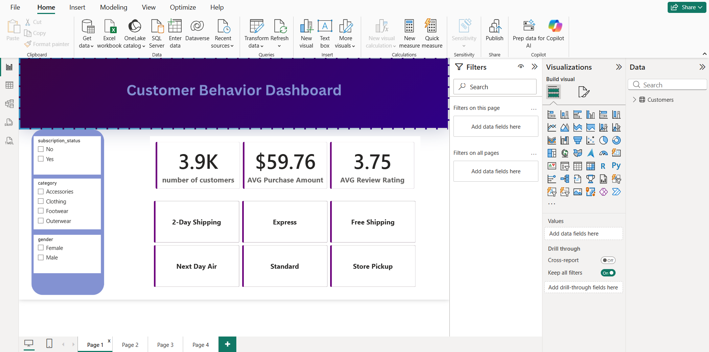

# 🛍️ Customer Behavior Analysis

## 📌 Project Overview

This project analyzes customer shopping behavior to uncover purchasing patterns, customer demographics, and key business insights. The analysis was performed using Python for data exploration and visualization, with Power BI used to build an interactive dashboard for decision-making.

---

## 🎯 Business Objective

The goal of this project is to answer questions such as:

- Who are the most valuable customers?
- Which customer groups spend the most?
- How do age and gender influence purchasing behavior?
- What factors impact purchase amounts?
- How can businesses improve marketing strategies using customer insights?

---

## 📂 Dataset

The dataset contains customer shopping information, including:

- Customer Demographics
- Age
- Gender
- Category
- Purchase Amount
- Payment Method
- Frequency of Purchases
- Previous Purchases
- Discounts Applied
- Subscription Status

---

## 🛠️ Tools & Technologies

- Python
- Pandas
- NumPy
- Matplotlib
- Jupyter Notebook
- SQL
- Power BI
- CSV Dataset

---

## 📊 Project Workflow

1. Data Loading
2. Data Cleaning
3. Exploratory Data Analysis (EDA)
4. Customer Behavior Analysis
5. Data Visualization
6. Dashboard Development
7. Business Insights

---

## 📈 Dashboard

The interactive Power BI dashboard provides insights into:

- Customer demographics
- Purchase distribution
- Spending behavior
- Product category performance
- Customer segmentation
- Key Performance Indicators (KPIs)

### Dashboard Preview



---

## 📁 Repository Structure

```
customer-behavior-analysis
│
├── data/
│   └── customer_shopping_behavior.csv
│
├── notebooks/
│   └── Customer Behavior.ipynb
│
├── dashboard/
│   └── Customer Behavior.pbix
│
├── images/
│   └── dashboard.png
│
└── README.md
```

---

## 💡 Key Insights

- Identified purchasing trends across customer segments.
- Explored demographic factors affecting spending.
- Compared purchase behavior by gender and age group.
- Built an interactive dashboard for business users.
- Generated actionable insights to support data-driven decision-making.

---

## 🚀 Skills Demonstrated

- Data Cleaning
- Exploratory Data Analysis (EDA)
- Data Visualization
- Business Intelligence
- Dashboard Design
- Data Storytelling
- Business Analytics

---

## 📬 Contact

**Abdelrahman ElNabarawy**

- LinkedIn: https://www.linkedin.com/in/abdelrahman-el-nabarawy-3390b1246/
- GitHub:  https://github.com/abdelrahmanelnabarawy

---

⭐ If you found this project interesting, feel free to star the repository!
